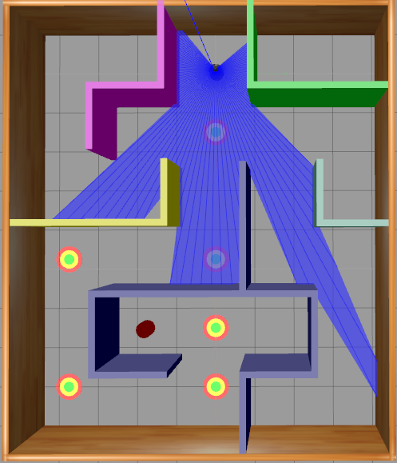
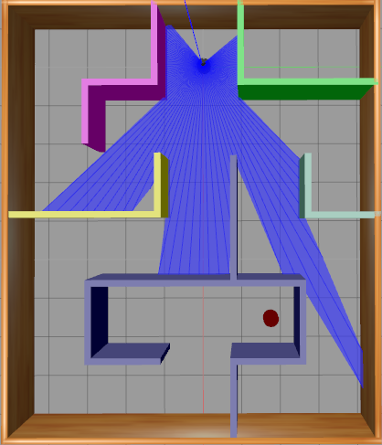
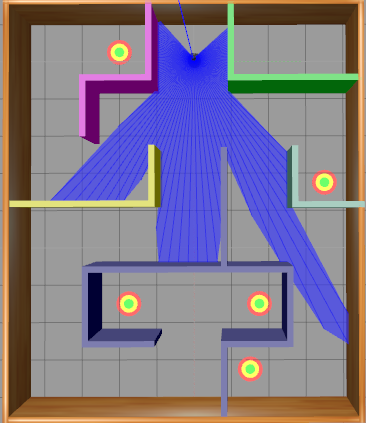
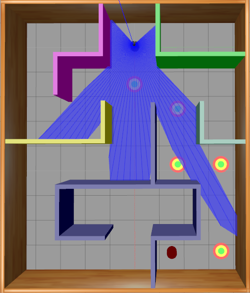

# Double Dueling Q Net

## Requirements
Basic requirements:
- python2
- [gym-gazebo](https://github.com/erlerobot/gym-gazebo)

## Environment setup

The gym-gazebo environments can be found [here](https://drive.google.com/open?id=19ldjgpsS303IGfPCBrT-WEf18FYy4quL).

- Copy `custom` folder to `gym-gazebo/gym_gazebo/envs`.
- Copy `launch`, `models`, `worlds` to `gym-gazebo/gym_gazebo/envs/assets` and skip duplicated files.
- Replace `__init__.py` file in the `gym-gazebo/gym_gazebo` folder with the `__init__.py` file here.
- Replace the line `<arg name="world_file"  default="/home/cloud/gym-gazebo/gym_gazebo/envs/assets/worlds/maze_color.world"/>` in the `gym-gazebo/gym_gazebo/envs/assets/launch/MazeColor.launch` file with your own path to the `maze_color.world` file

## Project structure
### Environments
The environment files used for different training and tesing situation. To use one environment, copy the code in `gazebo_turtlebot_maze_color*.py` to `gazebo_turtlebot_maze_color.py` in `gym-gazebo/gym_gazebo/envs/custom`
List environments:

- `gazebo_turtlebot_maze_color.py`: enviroment for training CNN model which use both image and laser as state input. To change target position, change line 52 `self.num_target = 1` to another index (from 0 to 2). 
- `gazebo_turtlebot_maze_color_laser_only.py`: enviroment for training laser model. The environment have 5 target position to be random at the start or after one episode end. 
- `gazebo_turtlebot_maze_color_laser_only_ver2.py`: environment for training laser model. The environment have 5 hint at 5 corner of the maze, the laser model can learn to go to the corner and turn back. 
- `gazebo_turtlebot_maze_color_laser-image.py`: environment for testing laser model with the image processing strategy. It have 5 different reward and hints positions which can be change by line 59 `self.num_target = 1` in the code to another index (from 0 to 4). 

### Model
We have 2 type of model:
- `ddq_model.py`: the model used CNN architecture and image with laser as input state. The model use the architecture proposed in this [paper](https://storage.googleapis.com/deepmind-data/assets/papers/DeepMindNature14236Paper.pdf)
- `laser_model.py`: The model use DNN and laser as input state.

## Usage

### Image CNN model
Replace code in `gym-gazebo/.../custom/gazebo_turtlebot_maze_color.py` with the code in `gazebo_turtlebot_maze_color.py` to use this model.

Train:
```
python qlearning.py
```

For more parameters: `python qlearning --help`

Test model: `python test.py <from_pretrain_dir> <epsilon>`
```
python test.py ddq_model 0.01
```

### DNN laser model
Replace code in `gym-gazebo/.../custom/gazebo_turtlebot_maze_color.py` with the code in `gazebo_turtlebot_maze_color_laser_only.py` or `gazebo_turtlebot_maze_color_laser_only_ver2.py` to use this model.
Train:
```
python laser_learning.py
```

For more parameters: `python qlearning --help`

Test model: `python test_laser_only.py <from_pretrain_dir> <epsilon>`
```
python test_laser_only.py laser-only 0.1
```

### Use laser model with hint detect strategy
Replace code in `gym-gazebo/.../custom/gazebo_turtlebot_maze_color.py` with the code in `gazebo_turtlebot_maze_color_laser-image.py` to use this model.

Run: `python test_laser_image.py <from_pretrain_dir> <epsilon>`
```
python test_laser_image.py laser-only 0.0
```

## Pretrain model
Some of our pretrain model can be found [here](https://drive.google.com/open?id=1g8cAxaL6CcqavwaLLHuiR6_4DxYZ_WFq)

It can be use as pretrain model or continue to train with the parameters `--from_pretrain` or `--continue_from` in the learning files. For examples: `python laser_learn --continue_from laser-only --output_dir laser-only`